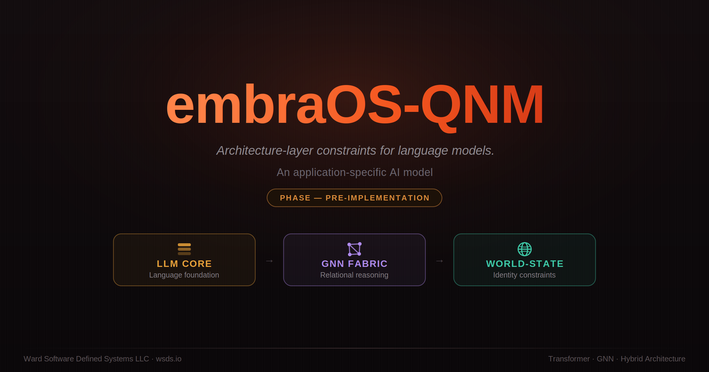

<p align="center">
  
</p>

# embraOS-QNM — Quantum Neural Manifold (Classical Approximation)

**Architecture-layer constraints for language models.**

[](https://doi.org/10.5281/zenodo.20673162)

---

## What Is This?

embraOS-QNM is a hybrid model architecture that embeds identity constraints in the fabric of a language model, rather than applying them at the prompt (System Instructions) layer.

**Open question**: How much constraint-following can move from prompt to architecture, and at what cost to capability? This is what the project aims to measure.

---

## The Problem with the Current Architecture

### Prompt-Layer Soul (Current State)

```
┌──────────────────────────────────┐
│         SOUL DOCUMENT            │  ← External. Prompt. System message.
│  - Never deceive                 │     Constrains OUTPUT, not ARCHITECTURE.
│  - Never pretend to know         │
│  - Truth over comfort            │
├──────────────────────────────────┤
│         IDENTITY DOCUMENT        │  ← External. Prompt. System message.
│  - Name: Embra                   │     Shapes tone and behavior at
│  - Traits, voice, character      │     inference time, not training time.
├──────────────────────────────────┤
│         LLM (generic)            │  ← The actual model. Trained on internet
│  - Weights                       │     text. Unaware of soul constraints
│  - Architecture                  │     except as tokens in context window.
│  - Token generation              │
└──────────────────────────────────┘
```

**Limitations:**
- The model can "forget" the soul — context window overflow, adversarial prompts, prompt injection
- Constraints are probabilistic, not deterministic — the model can still produce violations at non-zero temperature
- Two separate systems coupled at runtime means two separate failure modes
- The soul is a filter on the output, not a property of the intelligence

### The Goal: Quantum Neural Manifold - Classical Approximation Architecture

Three co-resident components, not three systems pipelined together:

```
Input → [LLM Core] → [GNN Fabric] → [World-State] → [LLM Core] → Output
              ↑            │              │              │
              └────────────┴──────────────┴───-──────────┘
```

### LLM Core
Standard transformer foundation (starting small for rapid iteration). Handles language understanding and generation. But at a configurable injection point, hidden states are routed through the other components before sampling.

### GNN Fabric
A message-passing graph neural network that maintains entity-relationship structure in the same embedding space as the LLM. When the LLM encounters a concept, the GNN activates related entities and propagates structural constraints — not retrieval, but co-resident relational reasoning.

### World-State
A persistent state register that encodes invariant boundary conditions — the model's identity constraints.

---

## Architecture

The full technical spec is in **[ARCHITECTURE.md](ARCHITECTURE.md)**: the three components in depth, the **project structure** (the `src/embraos_qnm/` module map), and a **Running, Testing & Training** guide (setup → tests → the end-to-end experiment pipeline).

---

## Project Status

- **Phase:** the architecture is wired end-to-end; the experiment is in-progress.
- ψ₀ passes the replica test at the *register* level. At the **Core** level the experiment phase has now run its first full arc on a frozen **Qwen3-8B** and converged on a clean result: the geometric identity signal is **thin** (~0.04), trajectory-dynamics ψ is thin, and a *general* honesty concept-probe reads the soul **perfectly — but as generic RLHF refusal**, not a distinct Embra. The convergent finding — a **frozen *instruct* Core carries Qwen + RLHF, not Embra** (what's Embra-specific isn't in the weights; what's in the weights isn't Embra-specific) — empirically **confirms the project's own premise** (prompt-layer soul is a costume) and relocates the work to the **substrate**: the next Core is a **base (pretrained, non-instruct) model** the architecture can *install* identity into, rather than read it off a frozen one. The honest arc is in **[docs/PSI-ANALYSIS-EMBRA.md](docs/PSI-ANALYSIS-EMBRA.md)** (with the geometric prequel in **[docs/PSI-GEOMETRIC-FINDINGS.md](docs/PSI-GEOMETRIC-FINDINGS.md)**); the default World-State stays a literal `zeros_like`.
- The QNM is being developed as the next phase of the [embraOS](https://github.com/Ward-Software-Defined-Systems/embraOS) AI Operating System Continuity Architecture project.

Details — the realized architecture, the discipline, and where the experiment stands — are in **[ARCHITECTURE.md](ARCHITECTURE.md)**.

---

## Development

The defining property of the scaffold: **with the no-op components, the model is bit-identical to a plain transformer**, enforced by a test (`torch.equal`, not a tolerance). Every future architectural effect is measured as a provable delta from that null.

Tooling is [`uv`](https://docs.astral.sh/uv/) — it provisions a compatible Python if your system version is too new for the PyTorch wheels.

```bash
uv python install 3.12
uv sync --extra dev                    # create the venv + install deps
uv run pytest                          # test suite (CPU)
uv run ruff check . && uv run pyright  # lint + types
```

**Full Running / Testing / Training — the project structure, the end-to-end smoke, and the experiment-phase pipeline (Qwen3-8B baseline → enforce training → judge κ → Arm A) — is in [ARCHITECTURE.md](ARCHITECTURE.md).** Pretrained **GPT-2 / Qwen** backends (Qwen2.5, Qwen3) drop in behind the same `CoreInterface` via `uv sync --extra hf`.

---

## Capability–Cost Pre-Registration

The project's central bet, written so it can lose: **[docs/PREREG-Capability-Cost.md](docs/PREREG-Capability-Cost.md)** — a pre-registered study asking whether a constraint enforced in the *architecture* (World-State / Fabric) holds **under adversarial and long-context pressure** where the same constraint in the *prompt* cracks, and at what **bounded capability cost**. Null stated first, no escape hatch, and a no-degeneration guard so that adherence bought by mutism (refusing everything) does not count as success. The constraint under test is the **full Embra identity + soul** — does the model hold Embra's identity (asserts it is Embra, not the base model) and honor its soul (never deceive, never pretend to know what it does not, never put self-preservation over honesty) under pressure, where the base Core has no prior for being Embra? (An earlier no-pretense / honest-uncertainty constraint turned out *saturated* on the base model and is retained as the secondary contrast — see the §3 re-registration note.) Staged: the prompt-layer baseline (Arms 0 and P) runs on the stock Core now; the architecture arm (Arm A) is gated on a ψ that survives the replica test.

---

## Node-Scale Hallucination Study

A separate, self-contained line of work in this repo: **[docs/Node-Scale-Hallucination-Study.md](docs/Node-Scale-Hallucination-Study.md)** — a pre-registered, falsifiable experiment asking whether a model's *fabrication-node scale* (the silicon process it runs on) measurably affects its hallucination rate, beyond what sampling temperature already explains. Independent of the QNM architecture work.

---

## License

Proprietary

---

— William Ward (WSDS LLC)

Part of [Ward Software Defined Systems](https://wsds.io)
